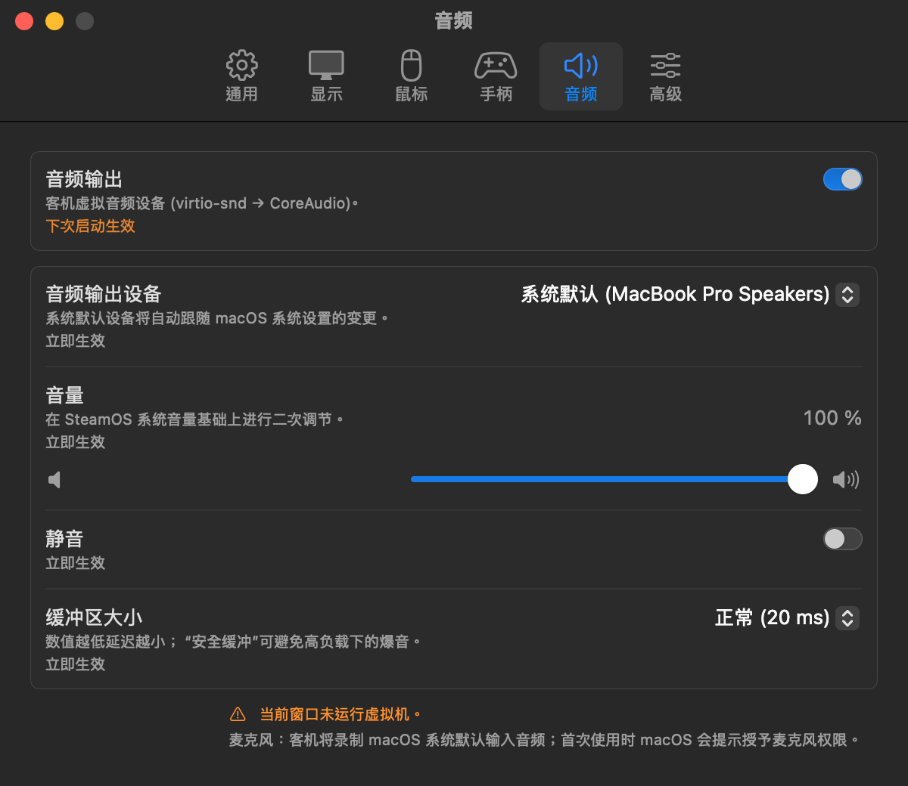
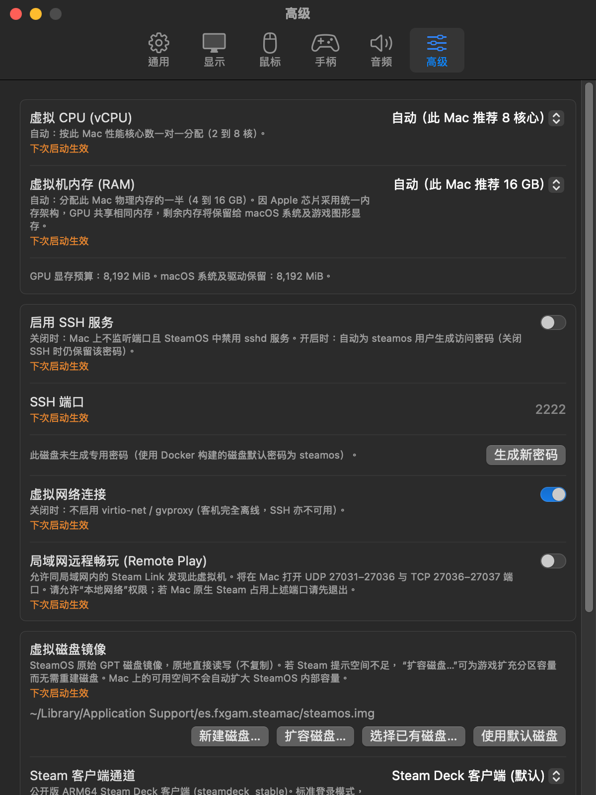
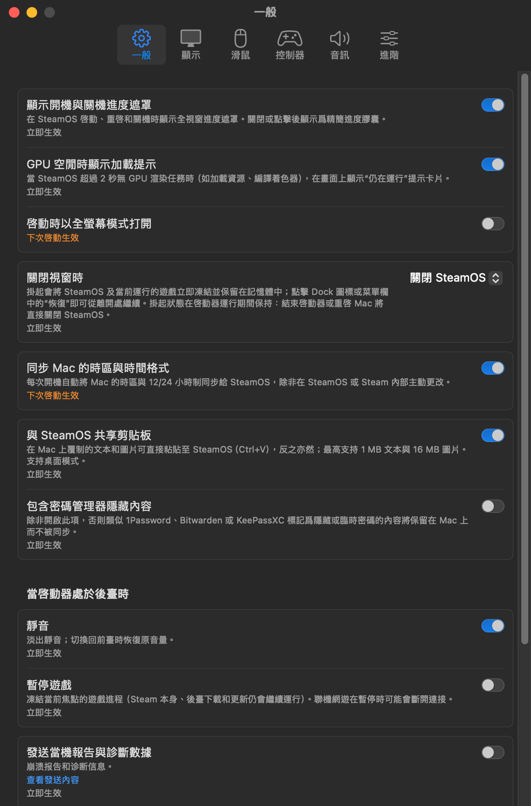
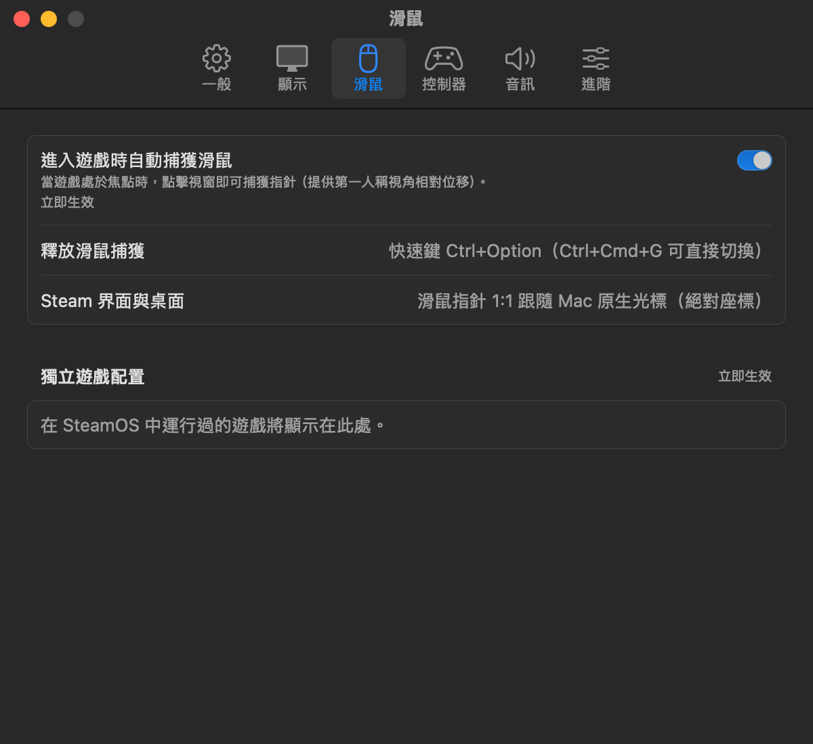
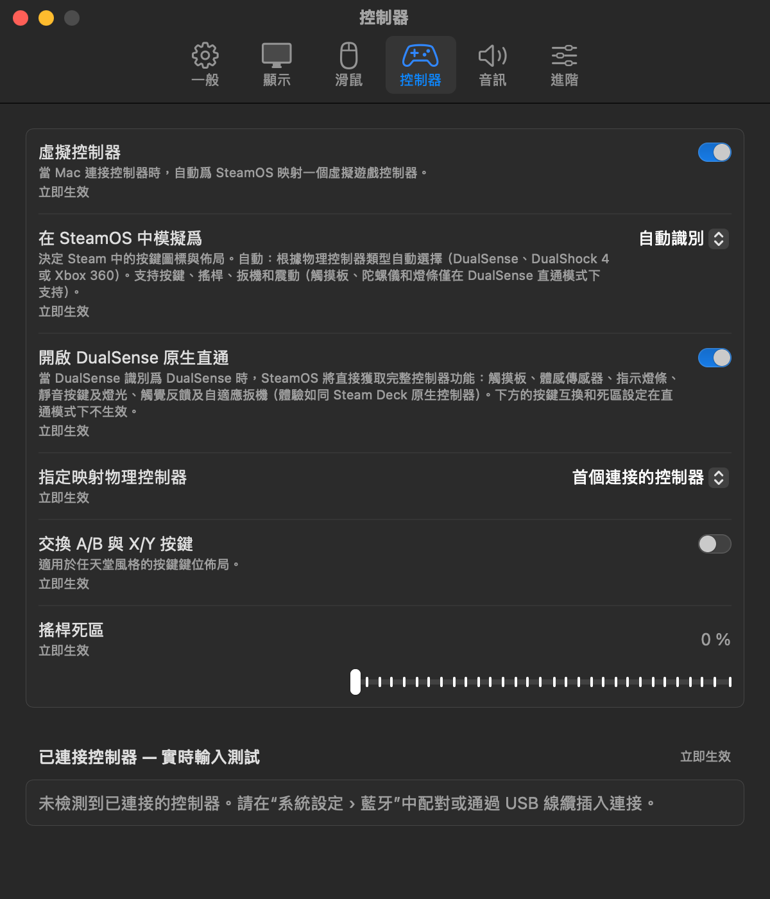
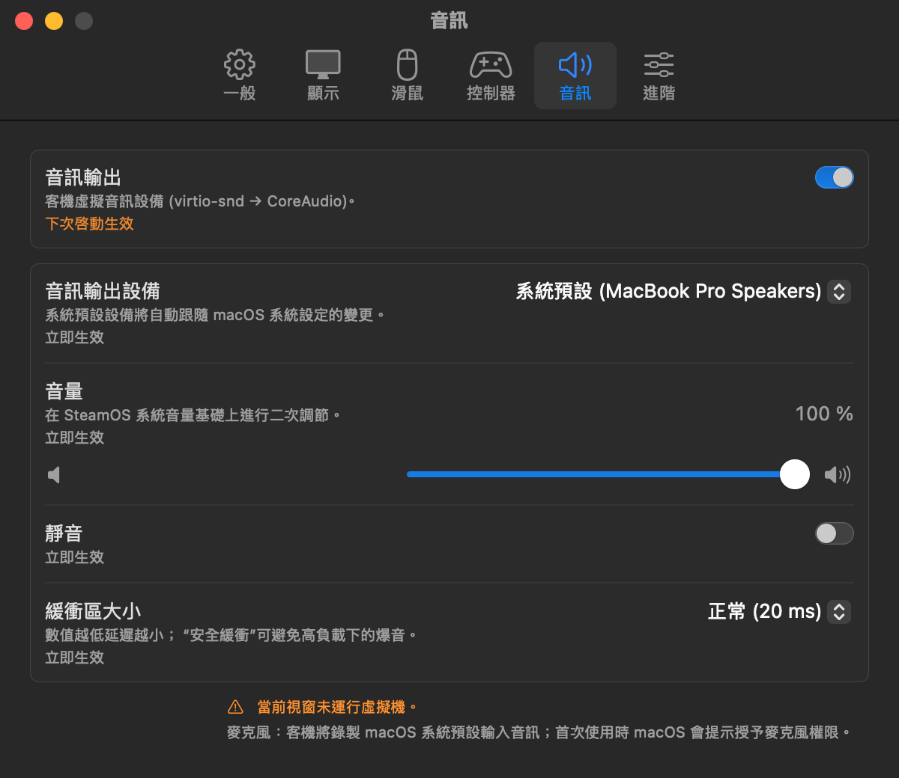
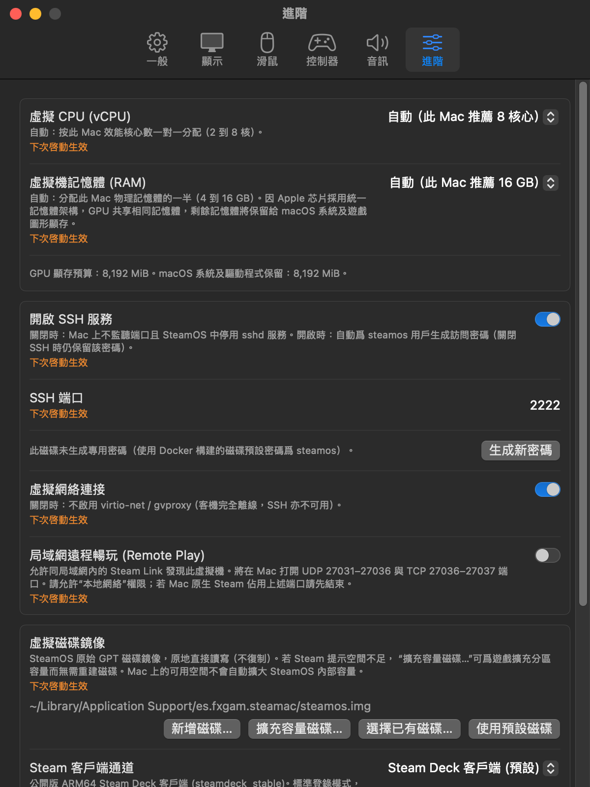
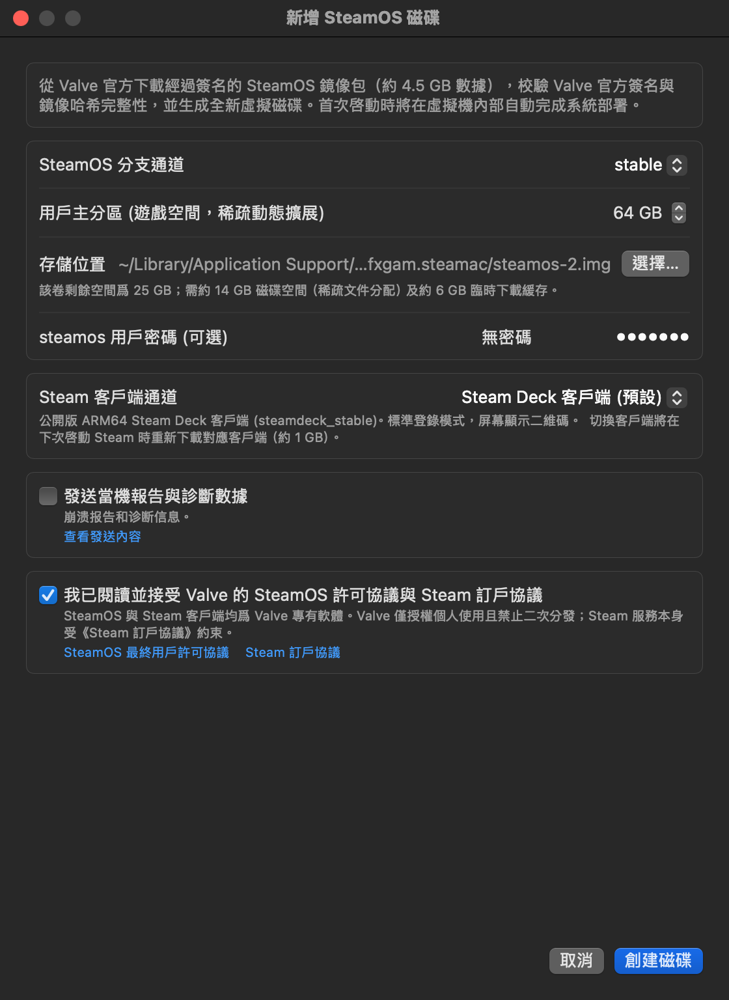
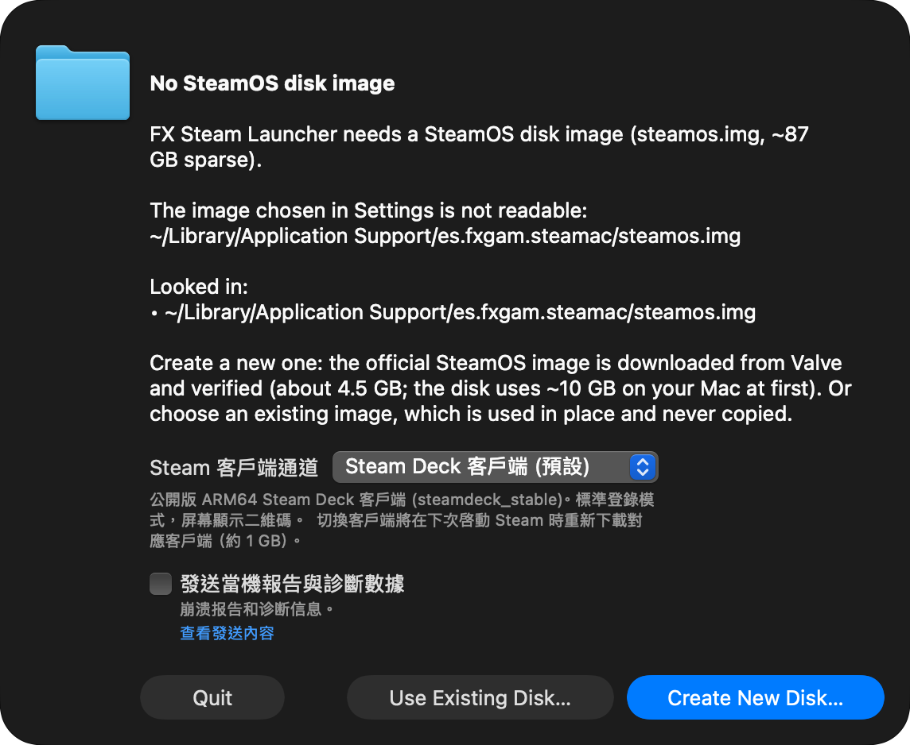

# FX Steam Launcher 中文汉化补丁 (简体中文 & 繁體中文)

<p align="center">
  
</p>

<p align="center">
  <b>专为 Apple Silicon (M1/M2/M3/M4) Mac 打造的 FX Steam Launcher (SteamOS ARM64 虚拟机启动器) 原生中文汉化项目。</b><br>
  完整支持 <b>简体中文 (zh-Hans)</b> 与 <b>繁體中文 (zh-Hant)</b> 原生双语。
</p>

<p align="center">
  <a href="https://github.com/Usagi53Q/fx-steam-launcher-zh/releases"></a>
  <a href="#-一键安装"></a>
  <a href="#-语言支持"></a>
  <a href="#-支持环境"></a>
  <a href="LICENSE"></a>
  <a href="https://github.com/fxgl/steamac"></a>
</p>

---

## 📖 项目简介

[FX Steam Launcher (steamac)](https://github.com/fxgl/steamac) 是一款优秀的 macOS 原生虚拟化启动器，允许在搭载 Apple Silicon 芯片的 Mac 上以超高图形性能直接运行原生 ARM64 SteamOS。

然而，原版启动器的 macOS 宿主机界面、顶部系统菜单及核心设置（Settings）全部为英文。本项目通过**源码级本地重构与汉化**，提供体验极佳的原生中文支持，并兼顾**简体中文与繁體中文（符合 macOS 繁体中文习惯用法）**。

### ✨ 核心特性

- 🌐 **双语深度原生汉化**：完美支持**简体中文**与**繁體中文**，macOS 菜单栏、Settings 偏好设置六大标签页、新建磁盘向导、更新检测及交互覆盖层全部中文呈现。
- ⚡ **无外部网络依赖 & 体积精简 50%**：剔除了原版依赖中体积高达 800 MB 的外部 `sentry-cocoa` 追踪库，可执行文件体积从 7.9 MB 缩减至 **4.1 MB**，零遥测，保护隐私，运行响应更快。
- 🎮 **完整保留全部底层特性**：继续直接复用官方内置的底层高性能动态库（`libkrun.dylib`、`libMoltenVK.dylib` 等），完美支持 **DualSense 原生直通**、**MetalFX 硬件超分辨率**与 **Apple 原生 Metal 性能监控 HUD**。
- 🛡️ **安全无损 & 一键还原**：安装时自动备份官方原版核心为 `steamac-vm.orig`，随时可通过单行命令秒级恢复官方原版英文界面。

---

## 🚀 一键安装

打开 Mac 上的 **终端 (Terminal)** 应用程序，复制并粘贴运行以下任意一条命令即可：

### 方式 1：智能交互式安装（推荐）

直接运行以下命令，终端会提示你选择安装**简体中文**或**繁體中文**：

```bash
curl -fsSL https://raw.githubusercontent.com/Usagi53Q/fx-steam-launcher-zh/main/install.sh | bash
```

---

### 方式 2：单行静默指定版本安装

如果你希望一行命令直接指定安装目标语言，无需按键盘选择：

#### 安装简体中文版本 (Simplified Chinese)：
```bash
curl -fsSL https://raw.githubusercontent.com/Usagi53Q/fx-steam-launcher-zh/main/install.sh | bash -s -- --zh-hans
```

#### 安裝繁體中文版本 (Traditional Chinese)：
```bash
curl -fsSL https://raw.githubusercontent.com/Usagi53Q/fx-steam-launcher-zh/main/install.sh | bash -s -- --zh-hant
```

> 💡 **使用提示**：安装完成后，打开 `/Applications/FX Steam Launcher.app`，在启动器运行时按下快捷键 **`⌘ ,`（Command + 逗号）** 即可打开全中文设置面板。

---

### 方式 3：克隆仓库到本地安装

```bash
# 1. 克隆本仓库
git clone https://github.com/Usagi53Q/fx-steam-launcher-zh.git
cd fx-steam-launcher-zh

# 2. 运行一键安装脚本（可选择 简体 / 繁體）
./install.sh

# 或直接参数指定：
./install.sh --zh-hans   # 安装简体中文
./install.sh --zh-hant   # 安裝繁體中文
```

---

## 🔄 一键卸载与恢复官方原版

如果想随时换回官方纯英文版本，只需在终端中执行：

```bash
# 远程命令一键还原：
curl -fsSL https://raw.githubusercontent.com/Usagi53Q/fx-steam-launcher-zh/main/uninstall.sh | bash

# 或者在克隆的仓库目录中执行：
./uninstall.sh
```

或者手动恢复备份：
```bash
cp -p "/Applications/FX Steam Launcher.app/Contents/MacOS/steamac-vm.orig" "/Applications/FX Steam Launcher.app/Contents/MacOS/steamac-vm"
```

---

## 📸 实机界面截图预览

<details open>
<summary><b>点击展开查看简体中文与繁體中文设置界面截图</b></summary>
<br>

### 简体中文界面 (Simplified Chinese)

| 通用设置 (General) | 显示设置 (Display) |
| :---: | :---: |
|  |  |

| 鼠标设置 (Mouse) | 控制器设置 (Controller) |
| :---: | :---: |
|  |  |

| 音频设置 (Sound) | 高级设置 (Advanced) |
| :---: | :---: |
|  |  |

<br>

### 繁體中文介面 (Traditional Chinese)

| 一般設定 (General) | 顯示設定 (Display) |
| :---: | :---: |
|  |  |

| 滑鼠設定 (Mouse) | 控制器設定 (Controller) |
| :---: | :---: |
|  |  |

| 音訊設定 (Sound) | 進階設定 (Advanced) |
| :---: | :---: |
|  |  |

| 新增 SteamOS 磁碟精靈 | 首次執行設定導覽 |
| :---: | :---: |
|  |  |

</details>

---

### 🛠️ 项目目录结构

```text
fx-steam-launcher-zh/
├── install.sh                  # 智能一键安装脚本（自动适配 1.9+ 原生多语言与历史版本）
├── uninstall.sh                # 一键还原脚本（安全恢复官方原版状态）
├── resources/                  # macOS 原生本地化语言资源包 (适用于 1.9+)
│   ├── zh-Hans.lproj/          # 简体中文官方原生语言包
│   └── zh-Hant.lproj/          # 繁體中文原生本地化語言包
├── bin/                        # 预编译好的签名二进制核心 (适用于历史版本)
│   ├── zh-Hans/steamac-vm      # 简体中文版独立核心 (4.1 MB)
│   └── zh-Hant/steamac-vm      # 繁體中文版獨立核心 (4.1 MB)
├── docs/                       # 实机高清渲染截图
│   ├── zh-Hans/                # 简体中文截图资源
│   └── zh-Hant/                # 繁體中文截圖資源
├── src/                        # 汉化修改后的完整 Swift 源码（完全开源透明）
│   ├── zh-Hans/                # 简体中文全套 Swift 源码
│   └── zh-Hant/                # 繁體中文全套 Swift 原始碼
├── entitlements.plist          # macOS Hypervisor 与硬件驱动安全权限声明
├── LICENSE                     # MIT 开源许可证
└── README.md                   # 项目使用说明文档
```

---

## ❓ 常见问题 (FAQ)

### Q1: 官方更新 1.9 版本后为什么启动器依然显示英文？
**A:** 
1. 官方 1.9 开始内置了简体中文，但其语言切换遵循 macOS 系统语言。若你的 Mac 系统首选语言设置为英文、日文等，官方启动器仍会默认显示全英文。运行本项目的 `install.sh` 脚本可将启动器首选语言锁定为中文。
2. 官方 1.9 目前**尚未提供繁體中文 (zh-Hant)**，若系统首选语言为繁体中文亦会回退为英文。本项目补齐了完整的繁體中文原生本地化資源包。

### Q2: 汉化安全吗？是否会影响虚拟机内的游戏存档或系统稳定性？
**A:** 绝无影响。
1. 本补丁仅针对 macOS 宿主机端的启动器界面进行本地化，客机系统内部（SteamOS 分区、Proton 容器、游戏文件与 Steam 官方云存档）完全独立运行于虚拟磁盘镜像中，丝毫不会受到影响。
2. 在 1.9+ 版本中，通过原生语言包架构运行，保留了 100% 官方数字签名与 Apple 公证，绝无报毒或 Gatekeeper 损坏提示。

### Q3: 繁体中文的术语翻译规范是怎样的？
**A:** 本项目的繁体中文版本完全贴合 Apple macOS 系统标准的繁体中文本地化习惯，例如：“偏好設定”、“滑鼠”、“顯示”、“控制器”、“音訊”、“進階”、“結束”等，确保如同 macOS 原生系统应用般的细腻体验。

---

## 📄 开源许可

本项目遵循 [MIT License](LICENSE) 开源协议。
上游原版 FX Steam Launcher 归属于 [fxgl/steamac](https://github.com/fxgl/steamac) 及其贡献者。
SteamOS 及 Steam 图标商标归属于 Valve Corporation。
