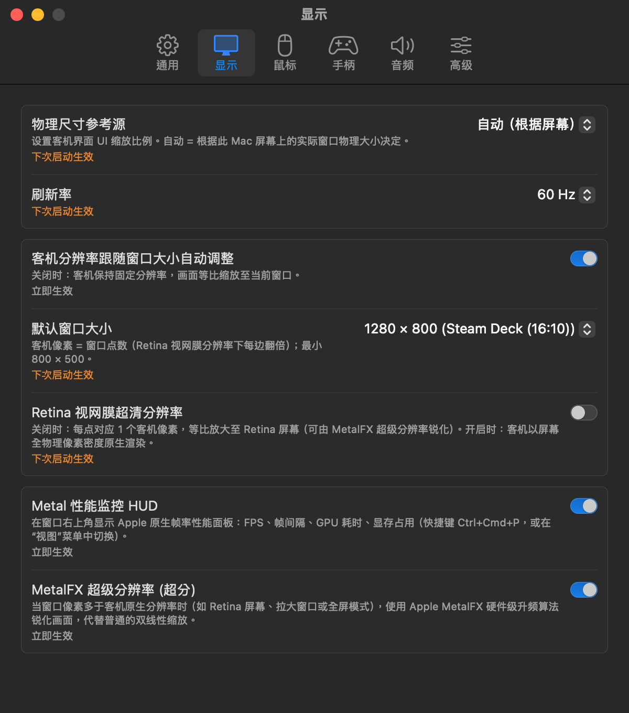
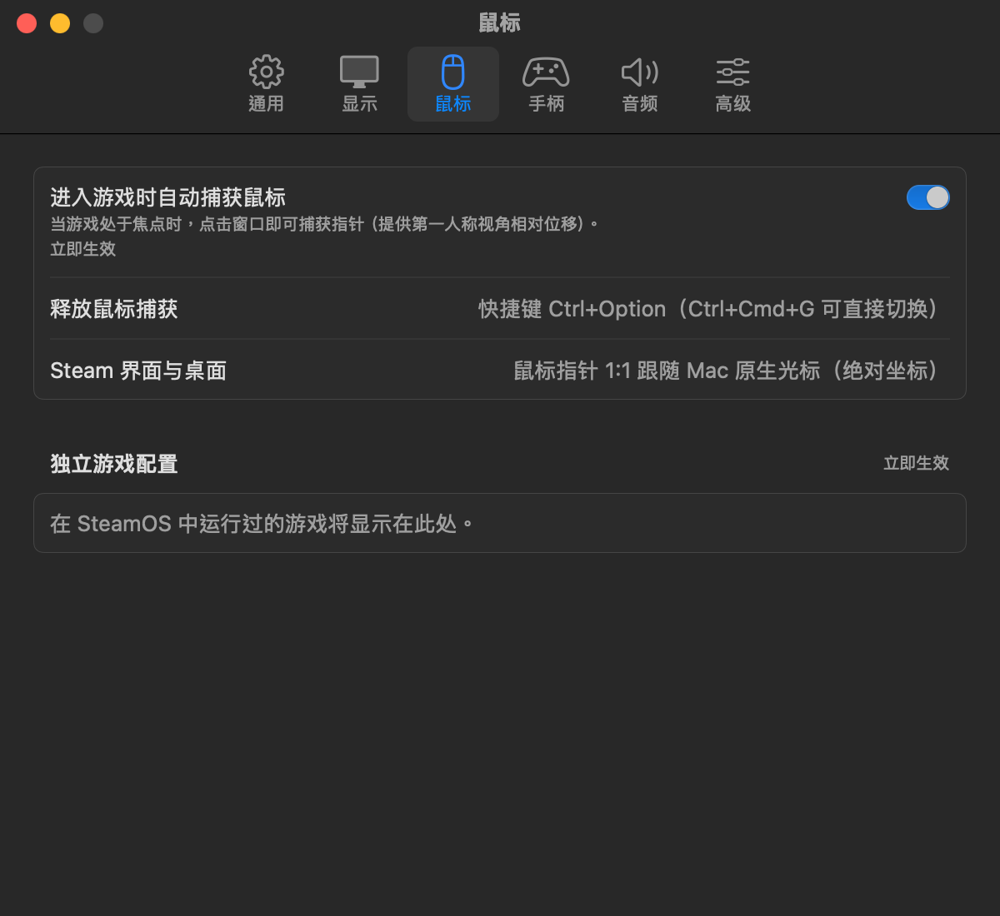
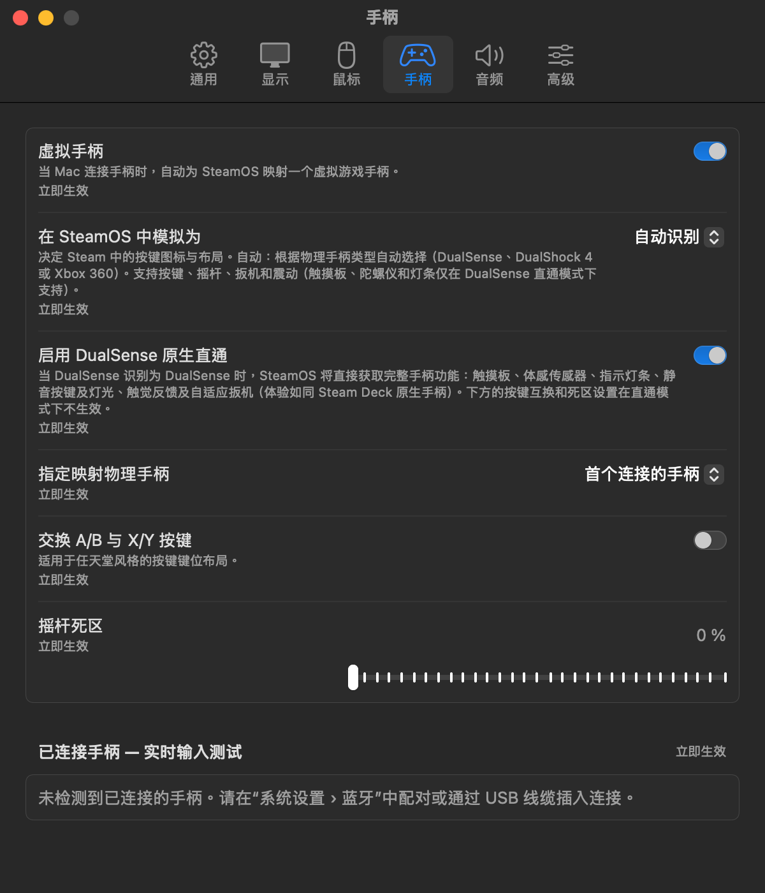
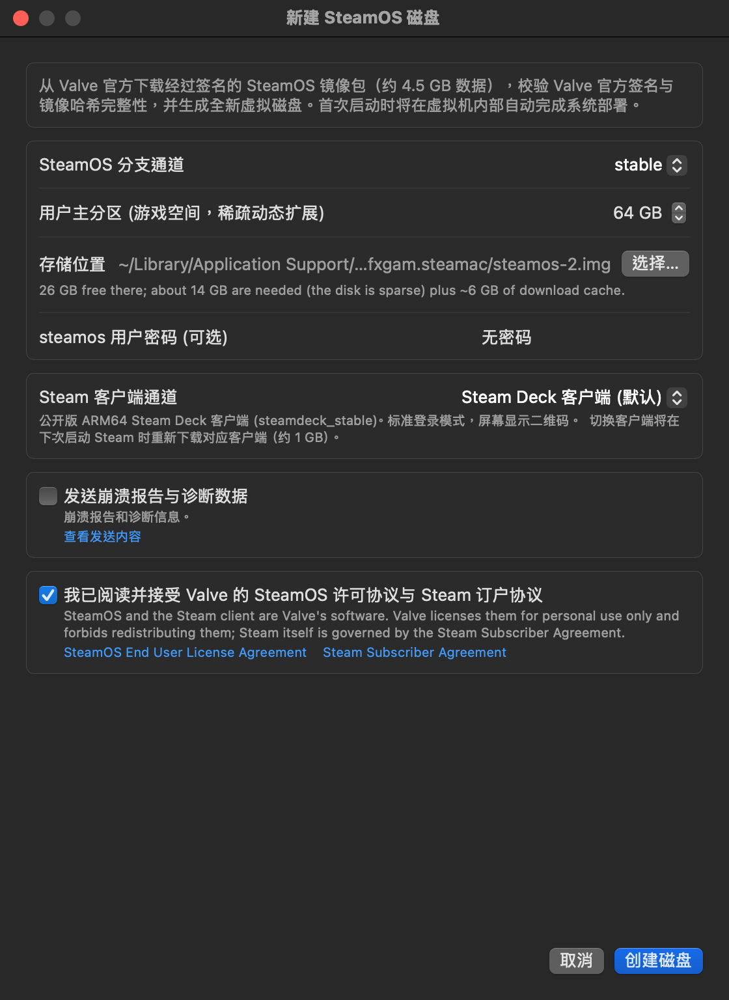
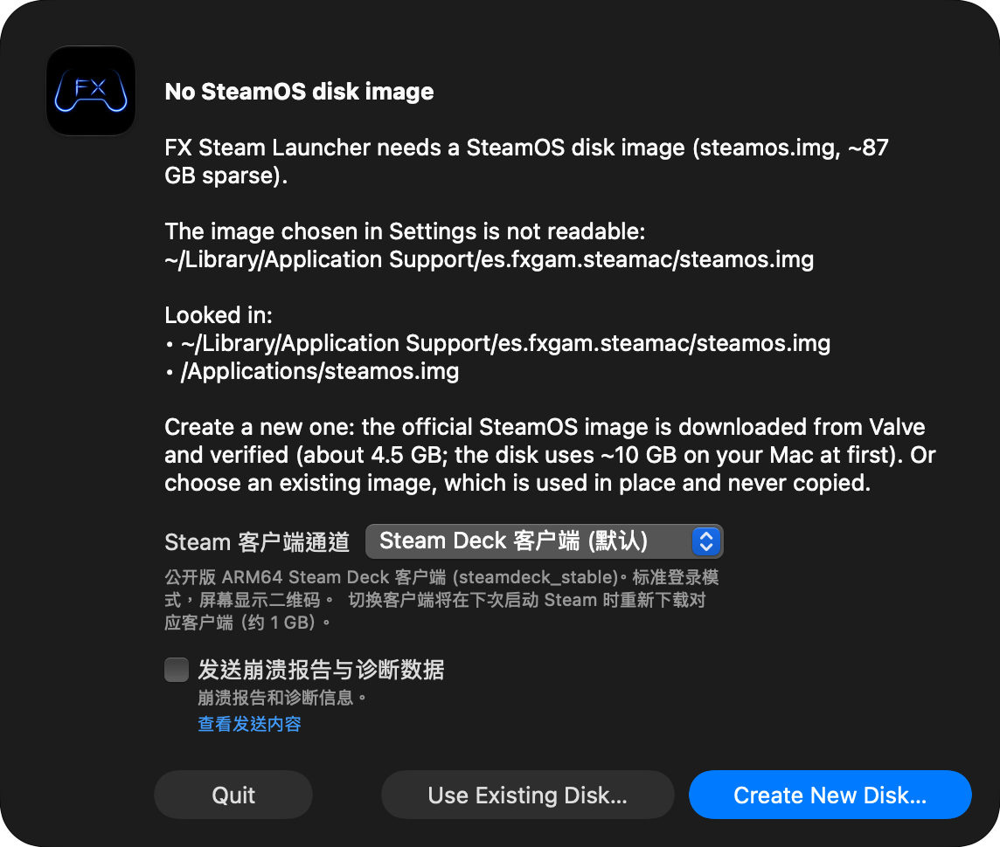

# FX Steam Launcher 简体中文汉化补丁 (macOS ARM64)

<p align="center">
  
</p>

<p align="center">
  <b>专为 Apple Silicon (M1/M2/M3/M4) Mac 打造的 FX Steam Launcher (SteamOS ARM64 虚拟机启动器) 原生简体中文汉化项目。</b>
</p>

<p align="center">
  <a href="https://github.com/Usagi53Q/fx-steam-launcher-zh/releases"></a>
  <a href="#-一键安装"></a>
  <a href="#-支持环境"></a>
  <a href="LICENSE"></a>
  <a href="https://github.com/fxgl/steamac"></a>
</p>

---

## 📖 项目简介

[FX Steam Launcher (steamac)](https://github.com/fxgl/steamac) 是一款优秀的 macOS 原生虚拟化启动器，允许在搭载 Apple Silicon 芯片的 Mac 上以超高图形性能直接运行原生 ARM64 SteamOS。

然而，原版启动器的 macOS 宿主机界面、顶部系统菜单及核心设置（Settings）全部为英文。本项目通过**源码级本地重构与汉化**，提供了体验极佳的原生中文支持。

### ✨ 核心特性

- 🇨🇳 **全界面深度汉化**：macOS 顶部菜单栏、Settings 偏好设置六大标签页（通用、显示、鼠标、手柄、音频、高级）、新建磁盘向导、扩容磁盘、更新弹窗及各类交互覆盖层全部中文呈现。
- ⚡ **无外部网络依赖 & 体积精简 50%**：剔除了原版依赖中体积高达 800 MB 的外部 `sentry-cocoa` 追踪库，可执行文件体积从 7.9 MB 缩减至 **4.1 MB**，零遥测，保护隐私，运行响应更快。
- 🎮 **完整保留全部底层特性**：继续直接复用官方内置的底层高性能动态库（`libkrun.dylib`、`libMoltenVK.dylib` 等），完美支持 **DualSense 原生直通**、**MetalFX 硬件超分辨率**与 **Apple 原生 Metal 性能监控 HUD**。
- 🛡️ **安全无损 & 一键还原**：安装时自动备份官方原版核心为 `steamac-vm.orig`，随时可通过单行命令秒级恢复官方原版英文界面。

---

## 🚀 一键安装

打开 Mac 上的 **终端 (Terminal)** 应用程序，粘贴并运行以下任意一条命令即可：

### 方式 1：远程一键安装（推荐）

```bash
curl -fsSL https://raw.githubusercontent.com/Usagi53Q/fx-steam-launcher-zh/main/install.sh | bash
```

> 💡 **提示**：安装完成后，打开 `/Applications/FX Steam Launcher.app`，在运行时按下快捷键 **`⌘ ,`（Command + 逗号）** 即可打开全中文设置面板。

---

### 方式 2：克隆仓库到本地安装

```bash
# 1. 克隆本仓库
git clone https://github.com/Usagi53Q/fx-steam-launcher-zh.git
cd fx-steam-launcher-zh

# 2. 运行一键安装脚本
./install.sh
```

---

## 🔄 一键卸载与恢复官方原版

如果想随时换回官方纯英文版本，只需在终端中执行：

```bash
# 若使用远程命令一键还原：
curl -fsSL https://raw.githubusercontent.com/Usagi53Q/fx-steam-launcher-zh/main/uninstall.sh | bash

# 或者在克隆的仓库目录中执行：
./uninstall.sh
```

或者手动恢复备份：
```bash
cp -p "/Applications/FX Steam Launcher.app/Contents/MacOS/steamac-vm.orig" "/Applications/FX Steam Launcher.app/Contents/MacOS/steamac-vm"
```

---

## 📸 实机界面截图预览

<details open>
<summary><b>点击展开查看全部设置标签页截图</b></summary>
<br>

| 通用设置 (General) | 显示设置 (Display) |
| :---: | :---: |
|  |  |

| 鼠标设置 (Mouse) | 手柄设置 (Controller) |
| :---: | :---: |
|  |  |

| 音频设置 (Sound) | 高级设置 (Advanced) |
| :---: | :---: |
|  |  |

| 新建 SteamOS 磁盘向导 | 首次运行配置指引 |
| :---: | :---: |
|  |  |

</details>

---

## 🛠️ 项目目录结构

```text
fx-steam-launcher-zh/
├── install.sh              # 智能一键安装脚本（自动备份、签名与替换）
├── uninstall.sh            # 一键还原脚本（安全恢复官方英文原版）
├── bin/                    # 预编译好的轻量签名二进制核心
│   └── steamac-vm          # 中文版独立核心 (4.1 MB)
├── docs/                   # 实机高清渲染截图
├── src/                    # 汉化修改后的完整 Swift 源码（完全开源透明）
│   ├── SettingsWindow.swift
│   ├── Window.swift
│   ├── Settings.swift
│   ├── SteamClientView.swift
│   ├── PauseOverlay.swift
│   ├── Stall.swift
│   ├── CreateDiskWindow.swift
│   └── UpdateCheck.swift
├── entitlements.plist      # macOS Hypervisor 与硬件驱动安全权限声明
├── LICENSE                 # MIT 开源许可证
└── README.md               # 项目使用说明文档
```

---

## ❓ 常见问题 (FAQ)

### Q1: 汉化安全吗？是否会影响虚拟机内的游戏存档或系统稳定性？
**A:** 绝无影响。
1. 本汉化补丁仅替换了 macOS 宿主机端的启动器界面文本与交互逻辑，客机系统内部（SteamOS 分区、Proton 容器、游戏文件与 Steam 官方云存档）完全独立运行于虚拟磁盘镜像中，丝毫不会受到影响。
2. 驱动层面直接复用了官方打包好的 `libkrun` 与 `MoltenVK`，图形和运算性能保持 100% 原生表现。

### Q2: 提示“应用程序已被损坏”或无法打开怎么办？
**A:** macOS Gatekeeper 可能会拦截替换过的可执行文件。安装脚本已内置自动处理逻辑，如果手动替换遇到该提示，可在终端运行：
```bash
sudo xattr -cr "/Applications/FX Steam Launcher.app"
codesign --force --sign - "/Applications/FX Steam Launcher.app/Contents/MacOS/steamac-vm"
```

### Q3: 官方启动器发布新版本后怎么办？
**A:** 本仓库源码完全公开在 `src/` 目录下。当官方发布新版本后，我们将持续同步更新此补丁。如果想自行编译，可参考下方构建说明。

---

## 🏗️ 开发者自行编译指南

如果你希望从源码完全自行构建汉化版二进制：

```bash
# 1. 准备官方构建工作目录并检出源码
git clone https://github.com/fxgl/steamac.git
cd steamac/host/launcher

# 2. 将本项目的 src/*.swift 覆盖对应的源码文件
# 3. 运行 Swift 编译流水线
swift build -c release \
  -Xcc "-I/path/to/include" \
  -Xlinker "-L/path/to/lib" \
  -Xlinker -rpath -Xlinker @executable_path/../Frameworks

# 4. 使用项目的 entitlements.plist 签名
codesign --force --sign - --entitlements entitlements.plist .build/out/Products/Release/steamac-vm
```

---

## 📄 开源许可

本项目遵循 [MIT License](LICENSE) 开源协议。
上游原版 FX Steam Launcher 归属于 [fxgl/steamac](https://github.com/fxgl/steamac) 及其贡献者。
SteamOS 及 Steam 图标商标归属于 Valve Corporation。
